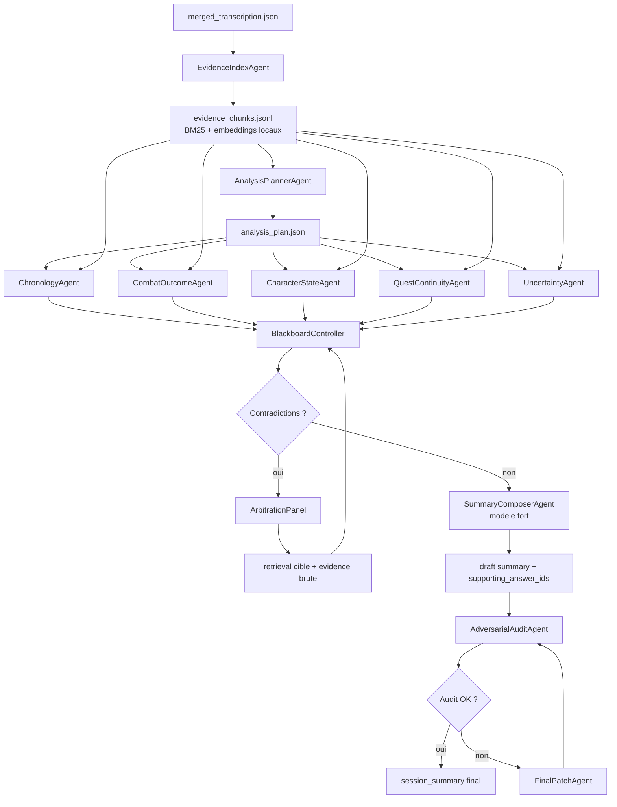
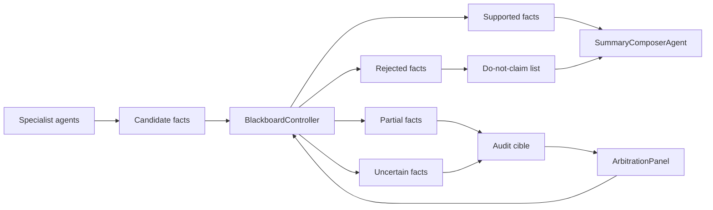

# Design 2 - Blackboard, retrieval local et audit adversarial

## Intention

Ce design repart de zero pour la partie analyse uniquement. La transcription reste intacte.

L'idee centrale est de ne plus organiser le pipeline autour des scenes. Les scenes deviennent optionnelles. Le pipeline est organise autour d'une blackboard d'analyse: plusieurs agents specialistes remplissent une memoire commune avec des faits sources, puis un agent de synthese compose le resume final et un agent auditeur controle les claims importants.

Ce design est plus ambitieux que le Design 1. Il vise une meilleure qualite sur les sessions longues, chaotiques ou tres tactiques, en evitant que le decoupage en scenes devienne le point de defaillance principal.

## Diagnostic du pipeline actuel

Le pipeline actuel force une chaine lineaire:

```text
transcription -> scenes -> descriptions longues -> resume -> verification
```

Cette chaine a trois faiblesses agentiques:

- Le decoupage en scenes decide tres tot de la structure du raisonnement. Si les bornes sont mediocres, tout le reste herite du probleme.
- Le systeme genere beaucoup de prose intermediaire, puis demande a un autre agent de la reduire fortement.
- La verification arrive tard, lorsque le resume final existe deja, donc elle corrige au lieu de guider la generation.

Le Design 2 remplace cette chaine par:

```text
transcription -> index local -> questions d'analyse -> agents specialistes -> blackboard -> synthese -> audit cible
```

## Pipeline propose

### Diagramme du pipeline



### Diagramme de la blackboard



### 1. Agent d'indexation locale

Entree: `merged_transcription.json`.

Role: construire un index local de preuves sans appel LLM couteux.

Index recommande:

- chunks glissants de 60 a 120 secondes;
- overlap de 15 a 30 secondes;
- texte + timestamps + ids de segments;
- BM25 lexical;
- embeddings locaux si disponibles;
- metadonnees simples: noms de personnages, mots de combat, soins, mort, repos, objets, lieux.

Sorties:

- `evidence_chunks.jsonl`
- `evidence_index.sqlite` ou equivalent

Schema de chunk:

```json
{
  "chunk_id": "c0042",
  "start": 2520.0,
  "end": 2640.0,
  "text": "...",
  "segment_ids": [481, 482, 483],
  "detected_entities": ["Molnir", "Karknyr"],
  "lexical_tags": ["soin", "jet_de_mort", "potion"]
}
```

But: le LLM ne lit jamais toute la transcription. Il demande ou recoit seulement les extraits utiles.

### 2. Agent planificateur d'analyse

Modele recommande: `gpt-5-mini`.

Role: produire une liste de questions analytiques a resoudre, en fonction du format de sortie attendu.

Exemples de questions:

- Que s'est-il passe chronologiquement?
- Quels changements d'etat durables affectent les personnages?
- Quelles menaces restent actives ou sont neutralisees?
- Quelles ressources ont ete depensees ou gagnees?
- Ou le groupe termine-t-il?
- Quelle est l'intention immediate ou le prochain probleme?
- Quels faits sont incertains et doivent etre evites dans le resume?

Sortie: `analysis_plan.json`.

Chaque question inclut:

- `question_id`
- `priority`
- `retrieval_queries`
- `required_output_schema`
- `risk_level`

### 3. Agents specialistes avec retrieval

Chaque agent lit le plan, interroge l'index local, puis ecrit sur la blackboard.

Agents proposes:

- `ChronologyAgent`: reconstruit les 8-15 evenements majeurs dans l'ordre.
- `CombatOutcomeAgent`: suit morts, inconsciences, ennemis neutralises, menaces restantes.
- `CharacterStateAgent`: suit position, ressources, blessures, etat final par personnage.
- `QuestContinuityAgent`: extrait les consequences pour la suite, objets, lieux, mecanismes, intentions.
- `UncertaintyAgent`: liste ce qui est confus, contredit ou non confirme.

Chaque agent produit des `EvidenceAnswer`, pas de prose finale.

Schema:

```json
{
  "answer_id": "combat_006",
  "question_id": "q_combat_outcomes",
  "claim": "Molnir meurt en fin de session apres la retraite du groupe.",
  "status": "supported",
  "importance": 5,
  "support": [
    {"chunk_id": "c0118", "start": 8406.2, "end": 8520.0},
    {"chunk_id": "c0120", "start": 8640.0, "end": 8760.0}
  ],
  "contradictions": [],
  "confidence": "high",
  "notes": "Fait final majeur, a inclure."
}
```

### 4. Blackboard commune

La blackboard est le coeur du design.

Elle contient:

- faits supportes;
- faits partiels;
- faits interdits ou non confirmes;
- etats finaux;
- evenements chronologiques;
- claims candidats pour le resume;
- liens vers chunks/timestamps.

Le role du superviseur est de maintenir les invariants:

- un fait `supported` doit avoir au moins un chunk;
- un fait `final_state` doit indiquer son timestamp le plus tardif;
- un fait contradictoire ne peut pas etre envoye tel quel au composeur;
- un fait `uncertain` peut guider le resume seulement sous forme prudente ou etre exclu.

### 5. Agent de synthese depuis blackboard

Modele recommande: `gpt-5.4` ou `gpt-5.1`, un seul appel principal.

Entree:

- top chronology facts;
- top continuity facts;
- etat final;
- incertitudes a eviter;
- historique des sessions precedentes si fourni.

Sortie:

- resume markdown;
- JSON structure;
- mapping claim -> `answer_id`.

Le composeur ne doit pas inventer de fait. Il doit choisir et organiser les faits deja poses sur la blackboard.

Contrat:

- `Resume Express`: prose chronologique.
- `Impacts Pour La Suite`: uniquement claims `importance >= 4`.
- `Etat Final Et Ressources`: uniquement faits `final_state` ou `resource_state`.
- chaque section garde ses `supporting_answer_ids`.

### 6. Agent auditeur adversarial

Modele recommande:

- cheap model pour la plupart des checks;
- modele fort uniquement si le fait est critique et contradictoire.

Role: attaquer le resume final avant sauvegarde definitive.

L'auditeur ne verifie pas tout aveuglement. Il cible:

- phrases sans `supporting_answer_ids`;
- claims qui combinent plus de deux faits;
- claims bases sur une reponse `partial`;
- claims de mort, ressource, position finale, menace neutralisee;
- noms propres ou lieux absents de la blackboard;
- claims proches d'une incertitude connue.

Pour chaque probleme, l'auditeur peut:

- demander plus de retrieval;
- retrograder un claim;
- exiger une reformulation;
- bloquer la sortie si un claim critique n'a pas de preuve.

### 6 bis. Agent d'arbitrage des contradictions

Modele recommande: commencer par des regles deterministes, puis escalader vers `gpt-5.4` uniquement pour les contradictions critiques non resolues.

Role: trancher les conflits entre agents specialistes avant la synthese finale.

Exemples de contradictions:

- `CombatOutcomeAgent` affirme que Molnir meurt, mais `CharacterStateAgent` le marque seulement inconscient.
- `ChronologyAgent` affirme que le groupe quitte le temple, mais `QuestContinuityAgent` place encore le groupe dans le sanctuaire.
- un agent affirme qu'une menace est neutralisee, un autre indique qu'elle poursuit le groupe.

Sortie d'arbitrage:

```json
{
  "conflict_id": "conflict_004",
  "claims": ["combat_006", "state_011"],
  "severity": "critical",
  "decision": "accept_claim",
  "accepted_answer_id": "combat_006",
  "rejected_answer_ids": ["state_011"],
  "basis": "latest_timestamp_raw_evidence",
  "required_summary_policy": "claim_allowed"
}
```

L'arbitrage peut aussi produire `claim_forbidden` quand la preuve ne permet pas de trancher. Dans ce cas, le composeur recoit explicitement l'interdiction d'affirmer ce fait.

### 7. Agent de reformulation finale

Modele recommande: `gpt-5-mini`, ou aucun si la synthese est deja bonne.

Role: appliquer les corrections de l'auditeur sans ajouter de nouveaux faits.

Ce dernier agent est optionnel. Il ne doit recevoir que:

- le resume;
- les corrections autorisees;
- les claims supportes a conserver;
- les claims interdits a retirer.

## Qualite attendue de l'output

La qualite attendue repose sur trois axes: utilite de campagne, fidelite factuelle et lisibilite.

### Utilite de campagne

Le resume final doit permettre de reprendre la prochaine session sans relire la transcription. Il doit donc privilegier:

- consequences durables;
- etat final des personnages;
- menaces encore actives;
- ressources importantes;
- objectifs ou intentions immediates;
- revelations, lieux, objets et mecanismes pertinents.

### Fidelite factuelle

Chaque phrase ou bullet final doit etre lie a au moins un `supporting_answer_id`. Pour les claims critiques, le `supporting_answer_id` doit lui-meme pointer vers un ou plusieurs chunks bruts.

Claims critiques:

- mort ou survie d'un personnage;
- inconscience, stabilisation, soin majeur;
- ennemi neutralise ou encore actif;
- position finale;
- ressource durable perdue ou gagnee;
- objet cle, mecanisme, quete ou revelation.

Ces claims ne peuvent pas etre bases seulement sur une interpretation globale. Ils doivent avoir un support direct.

### Lisibilite

Le composeur final doit respecter le contrat de sortie:

- `Resume Express`: chronologique, dense, sans detail inutile;
- `Impacts Pour La Suite`: bullets actionnables et autonomes;
- `Etat Final Et Ressources`: structure stable, aucune ambiguite sur les categories.

Il doit aussi recevoir une `do_not_claim_list` venant de la blackboard. Cette liste empeche les formulations seduisantes mais non prouvees.

Metriques proposees:

- `answer_support_rate`: pourcentage de facts blackboard avec support brut.
- `summary_support_rate`: pourcentage de phrases finales avec `supporting_answer_ids`.
- `critical_claim_direct_support_rate`: claims critiques supportes directement par chunks.
- `audit_rewrite_count`: nombre de reformulations exigees par l'auditeur.
- `forbidden_claim_leak_count`: nombre de claims interdits qui apparaissent quand meme dans le draft. Doit etre 0.

## Verification, contradictions et arbitrage

La verification est distribuee sur trois moments:

1. avant la synthese, dans `BlackboardController`;
2. pendant la synthese, via les `supporting_answer_ids` obligatoires;
3. apres la synthese, avec `AdversarialAuditAgent`.

### Qui arbitre ?

L'arbitrage appartient a `ArbitrationPanel`, pas au composeur. Le composeur n'a pas le droit de trancher une contradiction par style ou intuition narrative.

`ArbitrationPanel` applique cet ordre de priorite:

1. chunk brut le plus explicite;
2. chunk brut le plus tardif pour les etats finaux;
3. convergence de plusieurs agents specialistes avec supports differents;
4. answer `supported` avec confidence high;
5. answer `partial`;
6. claim non source, toujours rejete.

Pour les etats finaux, la temporalite compte fortement: un soin en milieu de session ne contredit pas une mort en fin de session. L'arbitre doit donc comparer les timestamps avant de declarer une contradiction.

### Que se passe-t-il s'il y a contradiction ?

Processus:

1. `BlackboardController` detecte deux facts incompatibles.
2. Le conflit est marque avec une severite: `minor`, `major`, `critical`.
3. `ArbitrationPanel` recupere les chunks sources des deux facts.
4. Si les chunks suffisent, l'arbitre accepte un claim, rejette l'autre, ou fusionne les deux.
5. Si les chunks ne suffisent pas, l'arbitre lance un retrieval cible avec les noms, timestamps et mots cles.
6. Si la contradiction reste non resolue:
   - claim critique: interdit dans le resume final;
   - claim non critique: formule prudemment ou retire;
   - etat final: remplace par "non confirme dans la transcription".
7. `AdversarialAuditAgent` verifie que le composeur n'a pas reintegre le fait interdit.

### Exemple de politique d'arbitrage

```json
{
  "policy": {
    "death_or_survival": "raw_evidence_required",
    "final_position": "latest_timestamp_wins_if_supported",
    "enemy_neutralized": "requires_explicit_neutralization",
    "resource_state": "prefer_explicit_spend_or_gain",
    "ambiguous_fact": "exclude_or_mark_unconfirmed"
  }
}
```

Le point important: l'arbitre ne cherche pas a rendre le resume plus dramatique. Il cherche a reduire le risque de fausse memoire de campagne.

## Design agentique complet

Agents:

- `EvidenceIndexAgent`: index local, pas de LLM fort.
- `AnalysisPlannerAgent`: cree les questions d'analyse.
- `ChronologyAgent`: repond a la chronologie.
- `CombatOutcomeAgent`: suit combat, mort, neutralisations, menaces.
- `CharacterStateAgent`: suit personnages et ressources.
- `QuestContinuityAgent`: suit objets, lieux, objectifs et consequences.
- `UncertaintyAgent`: capture les zones a ne pas sur-affirmer.
- `BlackboardController`: valide et dedoublonne les faits.
- `SummaryComposerAgent`: compose le resume.
- `AdversarialAuditAgent`: controle les claims a risque.
- `FinalPatchAgent`: reformule localement si necessaire.
- `ArbitrationPanel`: tranche les contradictions avant que le composeur ne voie les facts.

## Pourquoi ce design reduit les couts

- L'indexation locale remplace les prompts geants.
- Les agents specialistes ne lisent que des chunks recuperes.
- La synthese finale lit une blackboard compacte au lieu de la transcription.
- La verification est ciblee sur les claims a risque.
- Les petits modeles peuvent traiter les questions specialisees; le modele fort est reserve a la composition finale ou aux arbitrages critiques.

## Pourquoi ce design peut ameliorer la qualite

- Les questions importantes sont explicites avant la synthese.
- Les agents specialistes evitent de melanger combat, narration, ressources et etat final dans une seule generation.
- Les incertitudes sont conservees comme donnees, pas perdues.
- Le resume final est guide par une memoire structuree, pas par une chaine de prose generee.
- Le systeme peut mieux gerer les sessions chaotiques ou un simple decoupage en scenes ne reflete pas les enjeux.

## Difference avec le Design 1

Le Design 1 est un map-reduce factuel: il extrait tout en fenetres, puis structure.

Le Design 2 est question-driven: il part du besoin de sortie, recupere les preuves pertinentes, puis remplit une blackboard.

Consequences:

- Design 1 est plus simple, plus deterministe, plus rapide a implementer.
- Design 2 est plus puissant pour la qualite finale, surtout si les sessions sont longues et les evenements importants disperses.
- Design 2 depend davantage de la qualite du retrieval.

## Risques

- Le retrieval peut rater un extrait crucial si les requetes sont mauvaises.
- Plusieurs agents peuvent produire des claims redondants ou legerement divergents.
- Le superviseur blackboard devient important: sans invariants stricts, la memoire commune peut devenir brouillonne.

## Mitigations

- Utiliser retrieval hybride: BM25 + embeddings locaux + recherche par entites.
- Forcer chaque agent specialiste a declarer ses requetes et les chunks lus.
- Ajouter un pass "coverage": verifier que chaque tranche de 10-15 minutes a ete examinee par au moins un agent.
- Dedoublonner les claims par similarite lexicale et timestamp.
- Garder une liste explicite de faits interdits ou non confirmes, transmise au composeur.

## Implementation progressive possible

Sans toucher a la transcription:

1. Construire `EvidenceIndexAgent` sur `merged_transcription.json`.
2. Implementer seulement deux specialistes au depart: `ChronologyAgent` et `CombatOutcomeAgent`.
3. Generer un resume depuis la blackboard minimale.
4. Ajouter `CharacterStateAgent` et `QuestContinuityAgent`.
5. Ajouter l'audit adversarial cible.

Ce design est le meilleur choix si l'objectif prioritaire est la qualite d'analyse et la robustesse sur des sessions longues, avec une reduction de cout qui vient du retrieval et de l'escalation selective.
