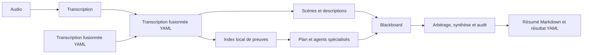

# Architecture de Tara

Tara traite une session de jeu de rôle depuis des fichiers audio ou une
transcription fusionnée. Le moteur Python est utilisable en ligne de commande,
par son API locale ou par l'interface web. Les formats d'entrée et de sortie
publics sont décrits dans [docs/schemas](docs/schemas).

## Entrées et orchestration

`src/tara/cli.py` valide les options de `python -m tara` ou de la commande
`tara`. `src/tara/pipeline.py` coordonne les étapes, l'annulation, la progression
et l'écriture des résultats. Une entrée audio est transcrite par
`src/tara/transcription.py`, qui appelle le serveur local
`src/inference_server/` ou Modal, puis fusionne les segments par horodatage.
Une entrée `--merged-transcription` commence directement à l'analyse.

Le fichier fusionné canonique est `merged_transcription.yaml`. Il conserve les
horodatages, le texte, les identifiants de segments et, lorsqu'elles sont
disponibles, les informations de locuteur. Son contrat est documenté dans
[merged-transcription.md](docs/schemas/merged-transcription.md).

## Analyse

`src/tara/analysis/scenes/` découpe la session en scènes, enregistre leurs
descriptions et convertit leurs faits en réponses exploitables par la
blackboard. `src/tara/analysis/evidence_index/` construit des extraits
horodatés et les recherche localement. La timeline des scènes fournit la trame
narrative; les extraits servent à vérifier les affirmations.

`src/tara/analysis/agents.py` regroupe le planificateur, les agents spécialisés
(chronologie, combat, personnages, quêtes et incertitudes), le contrôleur de
blackboard, l'arbitrage, la composition et l'audit. Les agents produisent des
faits avec des références aux éléments qui les soutiennent. Les contradictions
et les faits incertains sont traités avant la publication du résumé. L'audit
peut déclencher une correction bornée du résultat.

Les appels aux modèles passent par `LLMRunner` dans
`src/tara/analysis/llm_runner.py`, avec les backends API et Cursor CLI. Le mode
déterministe utilise la blackboard sans appel LLM pour l'analyse. Quand la
vérification des injections est activée, `src/tara/prompt_security.py` contrôle
le contexte et la transcription avant l'analyse.

## Sorties et confidentialité

Le moteur écrit `session_summary.md` et `session_summary.yaml` dans le dossier
d'analyse, ainsi que des artefacts internes de scènes, de preuves et d'usage.
`src/tara/schemas/public_result.py` construit le résultat public à partir d'une
liste explicite de champs. Les chemins locaux, prompts et traces internes ne
font pas partie de ce contrat public. Voir
[public-result.md](docs/schemas/public-result.md).

Les enregistrements, transcriptions, contextes et artefacts d'analyse sont des
données privées. Le dépôt ne doit contenir ni ces données, ni secrets, journaux
ou bases locales.

## Interface web et services

`src/tara_web/` gère les transferts reprenables, les jobs, SQLite, les artefacts,
les sauvegardes, les coûts et l'API web. Son runner Tara appelle le même moteur
que la CLI. `webinterface/frontend/` affiche l'avancement et le résultat.
`compose.yaml` assemble le service, l'administration et le proxy pour le
déploiement. Les contrats et procédures sont dans [docs/webinterface](docs/webinterface).

Le serveur d'inférence dans `src/inference_server/` expose une API de
transcription locale. `modal_inference.py` et les lanceurs `deploy_modal.*`
fournissent l'option Parakeet sur Modal; son fonctionnement est détaillé dans
[docs/modal_inference.md](docs/modal_inference.md).
