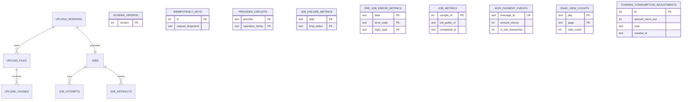

# Modele De Donnees SQLite

Le stockage de fichiers et les transitions d'artefacts sont documentes dans
[Stockage et artefacts](storage-et-artefacts.md).

`tara_web` et le tableau de bord local `tara_admin` sont les seuls proprietaires
SQLite; les workers n'importent jamais les repositories et n'ouvrent jamais cette
base. Les dates sont UTC et les couts sont des micro-euros entiers. `completed_at`
pilote la retention des echantillons historiques.

La promotion est une transaction immediate: les fichiers prets non affectes sont
revendiques, un job et une tentative sont crees, puis la session est consommee. Les cles
d'idempotence ne contiennent que des HMAC versionnes. Les sources et artefacts
intermediaires sont supprimes des que le job devient terminal; le YAML final
d'un job reussi expire apres une semaine. `jobs.private_artifacts_cleaned_at`
rend un echec de suppression durablement reessayable. `job_metrics` n'a
volontairement pas de FK: ses echantillons survivent a la purge du job et sont
purges par `completed_at`.

Depuis la migration 16, `jobs.identical_relaunch_job_id` enregistre le nouveau job
cree par une relance identique. La mise a jour conditionnelle depuis `NULL` garantit
qu'un timeout ne peut produire qu'un seul enfant identique, y compris sous concurrence
ou apres rejeu idempotent. Cette colonne reste dans le schema pour compatibilite,
mais la relance identique est desactivee depuis la politique de suppression
terminale de la migration 21.

La migration 18 ajoute les statistiques operateur. `page_view_counts` ne
contient que des agregats journaliers par type de vue. Les corrections de
consommation sont append-only et signees ; elles ne modifient jamais les couts
provider d'origine. Les evenements Ko-fi de test restent identifiables et sont
exclus de la jauge publique.
