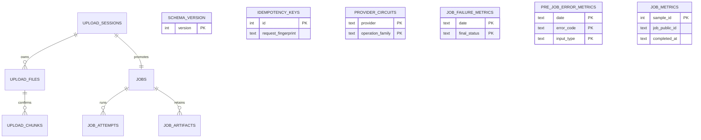

# Modele De Donnees SQLite

Le stockage de fichiers et les transitions d'artefacts sont documentes dans
[Stockage et artefacts](storage-et-artefacts.md).

`tara_web` est l'unique proprietaire SQLite; les workers n'importent jamais les
repositories et n'ouvrent jamais cette base. Les dates sont UTC et les couts sont des
micro-euros entiers. `completed_at` pilote la retention des echantillons historiques.

La promotion est une transaction immediate: les fichiers prets non affectes sont
revendiques, un job et une tentative sont crees, puis la session est consommee. Les cles
d'idempotence ne contiennent que des HMAC versionnes. Les artefacts intermediaires
expirent apres 24h, le YAML final apres une semaine. `job_metrics` n'a volontairement
pas de FK: ses echantillons survivent a la purge du job et sont purges par `completed_at`.
