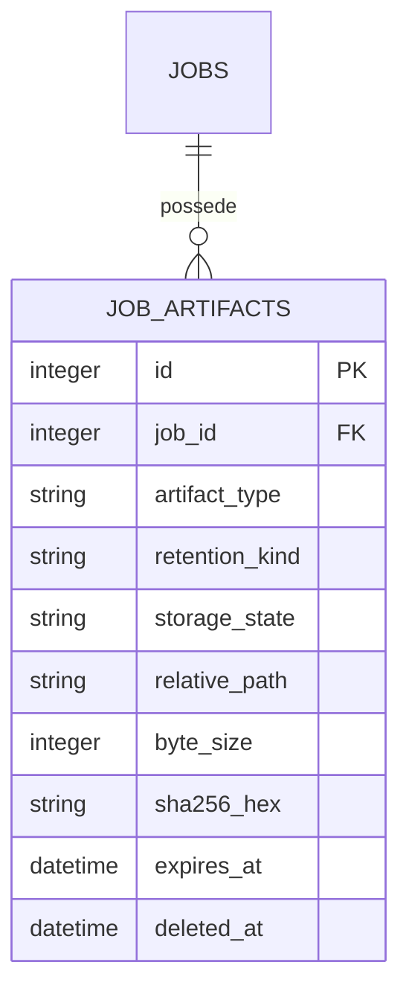

# Stockage et artefacts

L'etape 03 conserve les donnees binaires hors SQLite. SQLite ne contient que
des identifiants techniques, un chemin relatif genere par le backend, l'etat,
la taille, l'empreinte SHA-256 du resultat YAML et les dates de retention.
Les noms transmis par un client ne participent jamais au chemin physique.

Les chemins sont uniquement sous `uploads/<session_id>` ou
`jobs/<job_id>/{inputs,work,result}`. Les composants sont verifies avant les
operations sensibles: pas de chemin absolu, traversal, lecteur/UNC Windows,
antislash, NUL ou lien symbolique. Les repertoires geres sont prives (0700 sur
POSIX), les fichiers sont crees prives (0600), et les temporaires sont dans le
repertoire final afin de permettre `os.replace` atomique sur le meme volume.

Les transitions SQLite sont courtes et conditionnelles: `pending -> staged ->
ready` ou `error`, puis `ready|error -> deleting -> deleted|error`. Apres le
fsync du temporaire, sa taille, son hash et son nom sont commits en `staged`
avant le renommage atomique. Un redemarrage peut donc reprendre un temporaire
staged, ou verifier un final deja renomme, avant de le publier. Le YAML final
est toujours controle par le validateur structurel V1, puis par le validateur
de schema injecte lorsqu'il est disponible. Il est lu via un descripteur no-follow et
verifie par SHA-256. Une empreinte differente rend le resultat indisponible
(`result_integrity_failed`); elle n'est jamais remplacee.

Au demarrage, la reconciliation ne publie jamais un `pending` impossible a
prouver. Elle supprime son fichier eventuel et le place en erreur; un `staged`
complet est repris. Les suppressions expirables sont idempotentes, essaient
immediatement puis apres 100 ms et 500 ms, et conservent le compteur en base.
L'absence d'un fichier est un succes de retention. Le lifespan FastAPI execute
un cycle au demarrage puis chaque heure par defaut, avec des batches et une
grace d'orphelin configurables; une erreur de maintenance est journalisee sous
le code `storage_maintenance_failed` sans arreter le serveur. Les orphelins
restent limites aux noms backend sous les racines gerees. Il n'y a aucune
promesse de secure erase.

Une transition terminale (`completed`, `failed`, `timed_out`, `cancelled` ou
`cancel_failed`) declenche aussi un nettoyage prive recursif. Il supprime le
repertoire d'upload de la session et les arbres `inputs` et `work`, sans suivre
les liens symboliques. Un job reussi conserve seulement son dernier artefact
final `ready`; une autre issue supprime tout le repertoire `result`. Le contexte
et les resumes anterieurs en clair sont remplaces par des chaines vides en base.
Le marqueur `private_artifacts_cleaned_at` n'est ecrit qu'apres la suppression
physique complete; sinon le cycle de maintenance retente l'operation. Cette
politique rend la relance identique indisponible apres la fin du job.

Les workers Tara ne doivent pas importer `tara_web.db` ni choisir un chemin
public final. Ils recoivent les interfaces de stockage de l'application.
