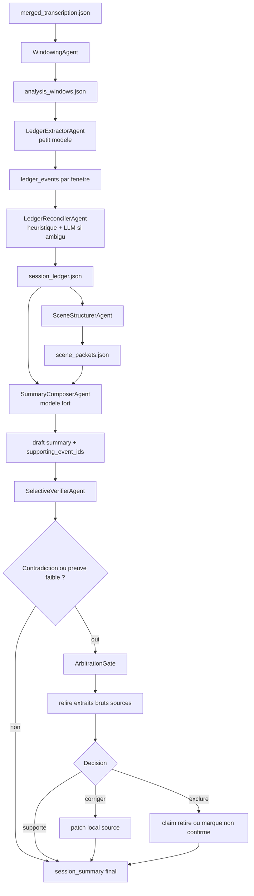

# Design 1 - Ledger extractif puis synthese contractuelle

## Intention

Ce design repart de zero pour la partie analyse uniquement. La transcription et le merge de transcription restent hors perimetre.

L'idee centrale est de remplacer le pipeline actuel "detecter les scenes -> ecrire une longue description par scene -> condenser -> verifier" par un pipeline beaucoup plus extractif:

1. transformer la transcription en petites fiches factuelles sourcees;
2. regrouper ces fiches en scenes ou moments narratifs;
3. produire le resume final a partir de ces fiches, pas a partir de longues descriptions generees;
4. verifier seulement les claims faibles ou non sources.

Le pipeline devient donc un ledger d'evenements. Chaque fait important garde un lien vers les timestamps et segments qui le supportent.

## Diagnostic du pipeline actuel

Le pipeline analyse actuel contient ces etapes:

- `SceneAnalyzerAgent`: envoie toute la transcription segmentee au LLM pour trouver les scenes.
- `TranscriptionSplitterAgent`: decoupe la transcription selon les bornes produites.
- `SceneDescriptorAgent`: refait un appel LLM par scene pour produire 200-400 mots.
- `SceneSummarizerAgent`: recondense toutes ces descriptions en un resume final de 200-300 mots.
- `SceneVerifierAgent`: verifie ensuite des claims avec plusieurs petits appels LLM possibles par claim.

Les couts viennent surtout de trois choix agentiques:

- Le premier agent lit souvent toute la transcription d'un coup. Dans `output.log`, un run precedent montre environ 121k tokens d'entree pour `scene_analyzer.analyze`.
- Les descriptions de scenes produisent beaucoup de texte intermediaire qui sera ensuite jete. Sur `Record19`, `scene_descriptions.json` indique 32 257 tokens pour 12 scenes.
- La verification arrive apres generation libre. Elle doit reparer des claims au lieu d'empecher leur apparition.

Ce design inverse la logique: d'abord extraire des faits compacts, puis composer.

## Pipeline propose

### Diagramme du pipeline



### 1. Agent de fenetrage deterministe

Entree: `merged_transcription.json`.

Role: creer des fenetres temporelles regulieres avec overlap leger, par exemple 8 a 12 minutes, sans decision LLM.

Sortie: `analysis_windows.json`.

Chaque fenetre contient:

- `window_id`
- `start`, `end`
- `segments`
- `text`
- `previous_overlap_start`, `next_overlap_end`

But agentique: ne pas demander a un LLM de trouver les scenes avant d'avoir des signaux compacts.

### 2. Agent extracteur de ledger

Modele recommande: modele peu couteux, par exemple `gpt-5-mini` ou `gpt-5-nano` selon la qualite observee.

Entree: une fenetre de transcription.

Sortie: une liste stricte de `LedgerEvent`.

Schema cible:

```json
{
  "window_id": 4,
  "events": [
    {
      "event_id": "w004_e03",
      "start": 1920.4,
      "end": 1998.1,
      "type": "combat_state_change",
      "importance": 4,
      "confidence": "high",
      "summary": "Aldrik cree un mur pour bloquer l'arrivee de nouveaux ennemis.",
      "actors": ["Aldrik"],
      "state_delta": ["mur defensif cree", "arrivee ennemie temporairement bloquee"],
      "open_threads": [],
      "evidence": [
        {"segment_start": 1931.2, "segment_end": 1948.7},
        {"segment_start": 1950.0, "segment_end": 1972.3}
      ]
    }
  ]
}
```

Contraintes de prompt:

- ne pas raconter;
- extraire seulement les faits utiles pour le resume de campagne;
- ignorer les micro details de jets sauf consequence durable;
- attribuer les personnages selon le mapping connu;
- chaque evenement doit avoir des timestamps;
- chaque evenement doit avoir `importance` et `confidence`.

### 3. Agent de reconciliation des fenetres

Modele recommande: peu couteux ou purement heuristique au depart.

Role:

- dedoublonner les evenements presents dans les overlaps;
- fusionner les evenements identiques ou quasi identiques;
- corriger les petits chevauchements temporels;
- produire un ledger chronologique unique.

Sortie: `session_ledger.json`.

Cet agent peut etre en grande partie deterministe:

- overlap temporel;
- similarite lexicale;
- memes acteurs;
- memes `state_delta`.

Le LLM n'intervient que sur les doublons ambigus.

### 4. Agent de scene depuis le ledger

Modele recommande: `gpt-5-mini`.

Role: regrouper les `LedgerEvent` en `ScenePacket`, sans relire toute la transcription.

Schema cible:

```json
{
  "scene_id": 7,
  "start": 3811.5,
  "end": 4301.8,
  "title": "Relevement inattendu de Molnir",
  "scene_function": "retournement",
  "core_events": ["w008_e01", "w008_e02", "w008_e03"],
  "summary_1_sentence": "Bidi rend 20 points de vie a Molnir, offrant au groupe un repit tactique.",
  "durable_changes": ["Molnir revient temporairement dans le combat"],
  "unresolved_threads": ["les ennemis restent actifs"]
}
```

Les scenes deviennent une vue organisee du ledger, pas la source principale de verite.

### 5. Agent de synthese finale

Modele recommande: `gpt-5.4` seulement ici, ou `gpt-5.1` si la qualite suffit.

Entree:

- `ScenePacket` compacts;
- les `LedgerEvent` de haute importance;
- l'historique des sessions precedentes, si fourni;
- le contrat de sortie final.

Sortie:

- `session_summary.json`
- `session_summary.md`

Le prompt doit exiger que chaque phrase ou bullet final porte des `event_ids` internes pendant le brouillon. Ces IDs peuvent etre retires du markdown final, mais conserves dans le JSON.

Exemple de sortie structuree:

```json
{
  "sections": [
    {
      "title": "Resume Express",
      "content": "...",
      "supporting_event_ids": ["w003_e02", "w008_e01", "w012_e05"]
    }
  ]
}
```

### 6. Agent de verification selective

Modele recommande: `gpt-5-mini`, avec escalation ponctuelle vers `gpt-5.4`.

Role:

- verifier uniquement les phrases dont les `supporting_event_ids` sont absents, faibles, contradictoires ou a basse confiance;
- relire les extraits bruts uniquement pour ces cas;
- ne pas faire de verification claim-by-claim exhaustive si le resume est deja source.

Regles:

- `confidence=high` + evidence directe: pas d'appel LLM.
- `confidence=medium`: verification heuristique ou LLM cheap.
- `confidence=low`, contradiction, fait tres important: verifier sur extrait brut.
- correction locale uniquement si le remplacement est lui-meme source.

## Qualite attendue de l'output

La qualite ne doit pas etre evaluee seulement par "le resume est joli". Le pipeline doit produire un resume utile pour reprendre une campagne et fiable factuellement.

Critere de qualite pour `Resume Express`:

- chronologie claire, sans retour en arriere confus;
- 3 a 5 phrases maximum, chacune supportee par des `event_ids`;
- personnages nommes par leur nom de personnage, pas par pseudo;
- pas de detail mecanique sans consequence durable;
- les tournants majeurs doivent etre presents: mort, fuite, victoire, perte, revelation, changement d'objectif.

Critere de qualite pour `Impacts Pour La Suite`:

- chaque bullet doit contenir un fait durable ou actionnable;
- aucun bullet ne doit commencer par un pronom ambigu;
- chaque bullet doit avoir au moins un `supporting_event_id`;
- les faits incertains doivent etre formules comme "non confirme" ou exclus.

Critere de qualite pour `Etat Final Et Ressources`:

- etat final pris dans les evenements les plus tardifs disponibles;
- ressources et menaces separees;
- mort, inconscience, fuite, position finale et objectifs immediats traites comme claims critiques;
- si la transcription ne permet pas de conclure, la sortie doit dire "non confirme dans la transcription".

Metriques automatiques proposees:

- `source_coverage_rate`: pourcentage de phrases ou bullets ayant au moins un support.
- `critical_claim_support_rate`: pourcentage de claims critiques supportes par evidence brute ou ledger high confidence.
- `unsupported_claim_count`: doit etre 0 dans la sortie finale.
- `contradiction_count`: nombre de contradictions detectees avant arbitrage.
- `final_uncertainty_count`: nombre de faits volontairement marques non confirmes.

## Verification, contradictions et arbitrage

Le systeme doit distinguer trois niveaux de conflit:

- `soft_conflict`: deux evenements racontent le meme fait avec une formulation differente, sans incompatibilite.
- `hard_conflict`: deux evenements affirment des faits incompatibles, par exemple "Molnir survit" contre "Molnir meurt".
- `missing_support`: le resume affirme un fait que le ledger ne supporte pas clairement.

### Qui arbitre ?

L'arbitre principal est `ArbitrationGate`, un composant de supervision avec des regles strictes. Il ne doit pas improviser une narration. Il applique un ordre de priorite:

1. preuve brute timestamped;
2. evenement ledger `confidence=high` avec evidence directe;
3. evenement ledger `confidence=medium`;
4. claim de synthese;
5. texte non source ou prose intermediaire.

Si deux claims sont contradictoires, l'arbitre demande une verification sur les extraits bruts couvrant les timestamps des deux claims. Si l'extrait brut tranche clairement, il conserve le claim supporte et marque l'autre comme rejete. Si l'extrait brut ne tranche pas, le fait ne doit pas etre affirme dans le resume final.

### Que se passe-t-il en cas de contradiction ?

Processus:

1. `SelectiveVerifierAgent` detecte la contradiction dans les `supporting_event_ids`, les timestamps ou les `state_delta`.
2. `ArbitrationGate` classe la contradiction: soft, hard, ou missing support.
3. Pour un `soft_conflict`, le reconciler fusionne les faits et garde la formulation la plus precise.
4. Pour un `hard_conflict`, l'arbitre relit les segments bruts relies aux deux claims.
5. Si la preuve brute supporte un seul claim, le resume est corrige.
6. Si la preuve brute reste ambigue, le claim est retire ou remplace par une formulation prudente.
7. Si le claim est critique, par exemple mort, ressource ou position finale, la sortie peut etre bloquee jusqu'a resolution.

Resultat attendu dans le JSON:

```json
{
  "arbitration": [
    {
      "claim": "Molnir meurt en fin de session.",
      "status": "accepted",
      "decision_basis": "raw_evidence",
      "supporting_event_ids": ["w012_e07"],
      "rejected_alternatives": ["Molnir est seulement inconscient."]
    }
  ]
}
```

## Design agentique complet

Agents:

- `WindowingAgent`: deterministe, prepare les fenetres.
- `LedgerExtractorAgent`: extrait des evenements sources.
- `LedgerReconcilerAgent`: fusionne et dedoublonne.
- `SceneStructurerAgent`: cree les scenes depuis le ledger.
- `SummaryComposerAgent`: produit le resume final.
- `SelectiveVerifierAgent`: controle seulement les zones a risque.
- `ArbitrationGate`: tranche les contradictions avec priorite a l'evidence brute.

Le superviseur ne doit pas etre un "agent intelligent" qui improvise. Il doit seulement appliquer des gates:

- aucun evenement sans evidence;
- aucune scene sans evenement;
- aucune phrase finale non sourcee dans le JSON;
- escalation uniquement sur les claims critiques.
- aucune contradiction critique non resolue dans la sortie finale.

## Pourquoi ce design reduit les couts

- Plus de prompt global massif pour trouver les scenes.
- Plus de descriptions 200-400 mots par scene qui servent surtout d'intermediaire.
- Les appels nombreux utilisent un petit modele sur des fenetres courtes.
- Le modele fort intervient une fois, sur une representation compacte.
- La verification devient selective au lieu de reparatrice.

Sur une session comme `Record19`, le ledger pourrait contenir 60 a 120 evenements compacts. Le composeur final lirait quelques milliers de tokens au lieu de relire la transcription ou des descriptions longues.

## Pourquoi ce design peut ameliorer la qualite

- Le resume est contraint par des faits sources, pas par de la prose intermediaire.
- Les decisions, etats finaux, ressources, morts, objectifs et menaces peuvent etre extraits explicitement comme categories.
- Le systeme garde une trace entre resume final et timestamps.
- Les hallucinations sont reduites avant la generation finale, pas corrigees apres coup.

## Risques

- Si l'extracteur de ledger rate un evenement important, la synthese finale ne le verra pas.
- Il faut bien calibrer `importance` pour ne pas noyer le composeur final.
- Les fenetres fixes peuvent couper un moment narratif. L'overlap et la reconciliation sont donc essentiels.

## Mitigations

- Ajouter un agent "coverage scan" cheap qui cherche les trous: longues zones sans evenement, nombreux noms propres ignores, changement brutal d'etat sans cause.
- Garder les evenements `medium` dans le ledger mais ne les envoyer au composeur que s'ils touchent un acteur, une ressource, un objectif ou une consequence durable.
- Comparer automatiquement la duree couverte par les evenements avec la duree totale de la session.

## Implementation progressive possible

Sans toucher a la transcription:

1. Ajouter le ledger extractor apres `merged_transcription.json`.
2. Generer un resume final directement depuis `session_ledger.json`.
3. Comparer ce resume avec le pipeline actuel sur `Record19`.
4. Ajouter seulement ensuite le scene structurer et la verification selective.

Ce design est le meilleur choix si l'objectif prioritaire est de reduire les couts vite tout en gardant une excellente tracabilite factuelle.
