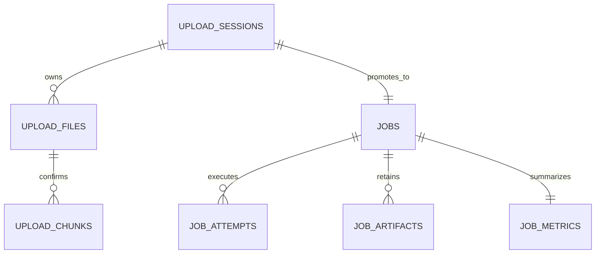

# Tara Web

## Prerequis

- Python 3.13 et `uv`;
- Node.js 22;
- Docker avec le plugin Compose pour le deploiement de reference.

Le deploiement partage ou expose doit utiliser Docker. Le lancement natif est
reserve au developpement local. Aucun secret ne doit etre place dans les fichiers
YAML versionnes.

## Docker Compose

```powershell
docker compose up --build -d
# http://127.0.0.1:8080
powershell -ExecutionPolicy Bypass -File scripts/smoke_web_compose.ps1
```

Le smoke test construit la pile, attend la page et les endpoints de sante, controle
l'isolation principale puis verifie l'arret par `SIGTERM`. Il a ete valide avec
Docker Desktop 29.6.1 lors de la livraison du socle et doit rester execute avant
chaque livraison.

## SQLite

SQLite, son WAL et son fichier SHM vivent ensemble dans le volume `tara_web_data`,
sous `/data/runtime`. Les migrations sont versionnees dans `src/tara_web/db/migrations`
et sont executees avant que l'application devienne prete; une version future est refusee.
Sous POSIX, les racines de stockage ne doivent etre ni des liens symboliques ni etre
inscriptibles par groupe/autres. Sous Windows, les ACL equivalentes restent une
verification operationnelle de l'administrateur.

Le [modele relationnel SQLite](../docs/webinterface/sqlite-data-model.md) decrit les
invariants de migrations, retention et propriete exclusive par le processus web.



## Developpement natif

Dans un premier terminal, depuis la racine du depot:

```powershell
$env:UV_CACHE_DIR='.uv-cache'; uv sync --extra dev
uv run tara-web --config config/webinterface.example.yaml
```

Dans un second terminal:

```powershell
Set-Location webinterface/frontend; npm.cmd ci; npm.cmd run dev
```

Vite est alors disponible sur `http://127.0.0.1:5173` et transmet `/api` au
backend natif lie a `127.0.0.1:8000`.

## Validation

Depuis `webinterface/frontend`:

```powershell
npm.cmd run check
npm.cmd audit
```

Depuis la racine du depot:

```powershell
$env:UV_CACHE_DIR='.uv-cache'; uv run pytest tests/web -q
uv run ruff check src/tara_web tests/web scripts/generate_web_openapi.py scripts/generate_i18n_manifest.py
```
